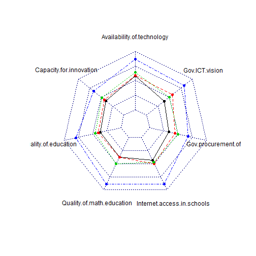

<style>
pre {
  font-size: 14px;
}
</style>

## Background

- I work for an international e-learning consultancy.

- We advise governments on how to integrate technology in the teaching of maths and science in schools.

- The type of advice offered varies significantly from country to country. The education needs of Singapore are quite different from Senegal. The technology available in Colombian schools is unrecognisable to that in Cambodia.

- We use data from the World Economic Forum to do an initial analysis of the e-learning landscape of a country. The objective of this project is to create a new tool that is far more user friendly and powerful than the manual process we currently use.

- The tool has been made from scratch, by me alone, for the JHU Developing Data Products Course. I intend to share it, and improve it, with my colleagues after the end of the course.

---

## Data

- The World Economic Forum publishes the Networked Readiness Index every year. http://reports.weforum.org/global-information-technology-report-2015/network-readiness-index/

- Data is published on 143 countries using 53 different metrics.

- For this E-Learning tool 7 relevant metrics have been chosen. These are all subjective metrics obtained by surveying business leaders. Each area is marked on a scale of 1 (worst) to 7 (best).

- The tool allows for the comparison of these metrics between countries chosen by the user. This shows the relative strengths and weaknesses of each country.

---

## Visualisation


```r
data <- read.DIF("dataset.dif", stringsAsFactors = FALSE, header = TRUE, transpose = TRUE)
require(fmsb)
selectedCountries <- c("Cambodia", "Colombia", "Singapore", "Senegal")
radarchart(rbind(rep(7,6), rep(1,6), subset(data, data$Country %in% selectedCountries)[,-1]))
```

 

```r
legend("topright", legend = input$select[order(selectedCountries)], col = 1:8, lty = 1:6)
```

```
## Error in as.graphicsAnnot(legend): object 'input' not found
```

---

## Tool

- Access the tool here: http://patak1123.shinyapps.io/E-LearningAnalysis

- Source code is here: https://github.com/PATAK1123/devdataprod

- The pitch (this document) is here: http://patak1123.github.io/
